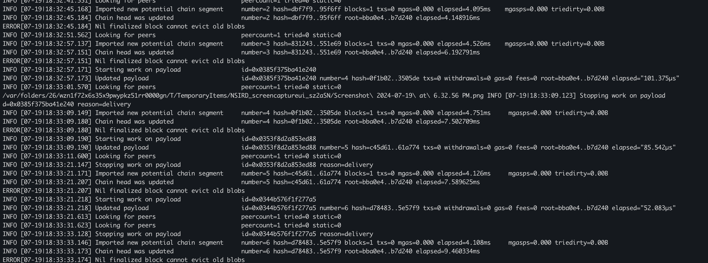

## Modified Beacon consensus (PoS)

```
/ CalcDifficulty is the difficulty adjustment algorithm. It dynamically adjusts
// the difficulty to maintain a target block time.
func (beacon *Beacon) CalcDifficulty(chain consensus.ChainHeaderReader, time uint64, parent *types.Header) *big.Int {
	// Define the target block time, e.g., 10 seconds
	const targetBlockTime = 10

	// Transition isn't triggered yet, use the legacy rules for calculation
	if reached, _ := IsTTDReached(chain, parent.Hash(), parent.Number.Uint64()); !reached {
		return beacon.ethone.CalcDifficulty(chain, time, parent)
	}

	// Calculate the time difference from the last block
	timeDiff := time - parent.Time

	// Adjust difficulty based on the time difference
	var newDifficulty = new(big.Int).Set(parent.Difficulty)
	if timeDiff > targetBlockTime {
		// Decrease difficulty if block time is greater than the target
		newDifficulty.Div(newDifficulty, big.NewInt(2)) // Simplified adjustment for demonstration
	} else if timeDiff < targetBlockTime {
		// Increase difficulty if block time is less than the target
		newDifficulty.Mul(newDifficulty, big.NewInt(2))
	}

	return newDifficulty
}
```


## Running clients 
A helper script that builds the submodules, saving the binaries in a known path
```bash
./build-dependencies.sh
```

## Running

Start testnet. This will start a test with a two validators. You should expect blocks to be produced. Logs are stored in `./network/node-*/logs`
The script is idempotent and will clean up every time it is restarted.
```bash
./testnet.sh
```



In a new shell, you can then attach to any of the generated nodes. 
If you have `geth` in your path you can run:

```bash
geth attach network/node-0/execution/geth.ipc 

> net.peerCount
> eth.blockNumber
```
Alternatively, you can use the built version of geth

```bash
./dependencies/go-ethereum/build/bin/geth attach network/node-0/execution/geth.ipc 

> net.peerCount
> eth.blockNumber
```

You can also interact with a beacon node you spin up
```bash
curl localhost:4100/eth/v1/node/identity
```

You can change the number of nodes to run by changing this line in `./testnet.sh`
```bash
# Change this number for your desired number of nodes
NUM_NODES=2
```

If you want to try submitting transactions, add your address to the `alloc` field in `./genesis.json` before running the testnet. This will premine your address some funds.
```json
"alloc": {
    // Replace with your address
    "123463a4b065722e99115d6c222f267d9cabb524": {
        "balance": "0x43c33c1937564800000"
    },
```
You can then send transactions using [cast](https://book.getfoundry.sh/cast/) while the network is running
```bash
# Get balance of an address
cast balance -r localhost:8000 0xFe8664457176D0f87EAaBd103ABa410855F81010

# Send 0.01 ether to 0x8D...8E
cast send -r localhost:8000 --private-key $PKEY 0x8D512169343cc6e108a8bB6ec5bc116C416eFc8E --value 0.01ether
```

Reach out to me on Twitter [@0xZorz](https://twitter.com/0xZorz) if you have any issues. DMs are open

## Coming Soon
- Deposits and Withdrawals

## FAQ / Common Issues
- ```
  go: cannot find main module, but found .git/config in /home/gopal/ethereum-pos-testnet
        to create a module there, run:
        cd ../.. && go mod init
  ```
  This occurs because the submodules were not cloned. Make sure to clone with the `--recursive` flag, i.e. `git clone --recursive https://github.com/rzmahmood/ethereum-pos-testnet.git`

- ```
  Nil finalized block cannot evict old blobs 
  ```
  This is expected log from Geth until a block is 'finalized'. The first finalized block will occur after 24 blocks.
